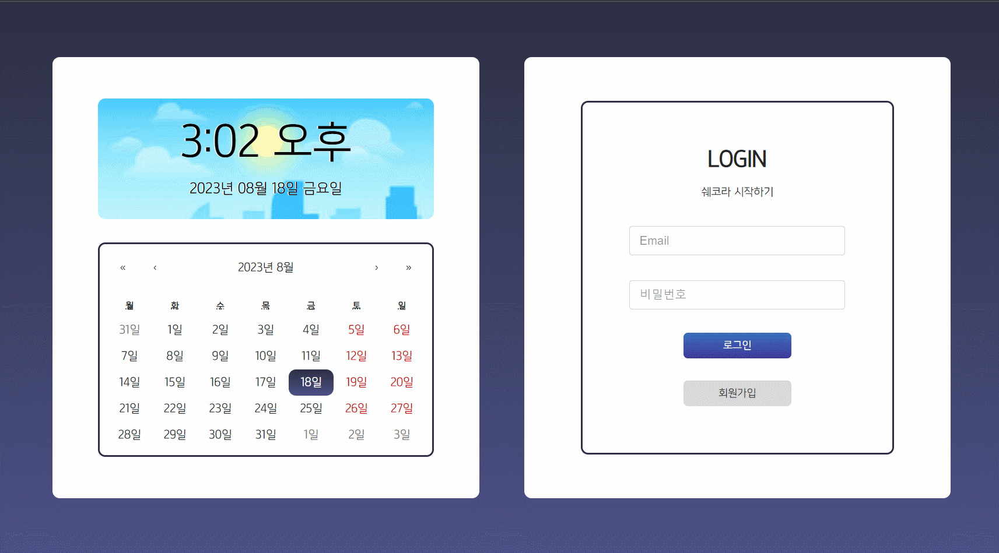
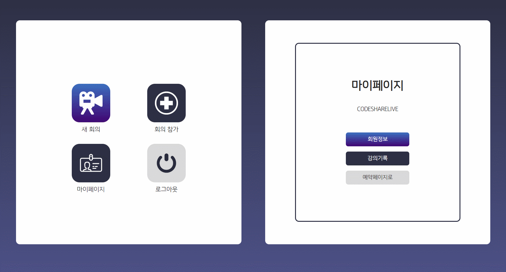
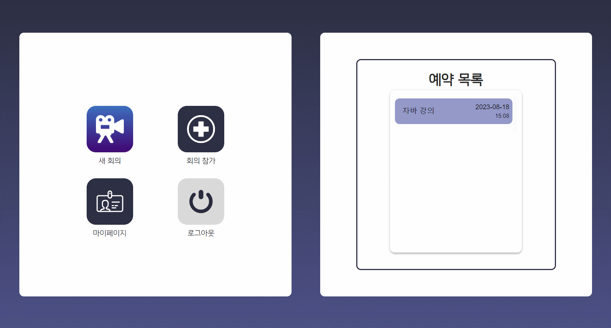
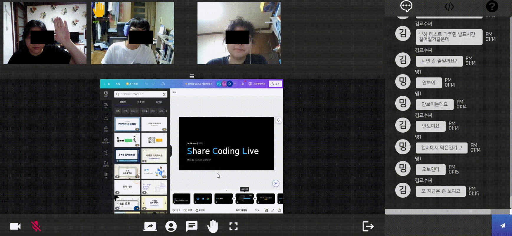

# 💻 쉐코라 ( Share Coding Live )

## 🌈쉐코라 소개 / 시연 영상🌈

- ## 📑 의의

  > 코로나의 영향이 미치던 시기는 지나갔지만 여전히 비대면 수업에 대한 수요는 그치지 않고 있습니다. 현존하는 화상 서비스에는 없는 편의 기능을 추가한 쉐코라로 소통이 활발한 비대면 수업을 해보아요!

- ## 📅 프로젝트 기간 - 2023.07.10 ~ 2021.08.18

- ## 👉 쉐코라 서비스 화면

  > 회원가입

  > 

  > 로그인

  > 

  > 마이페이지 - 닉네임 변경

  > 

  > 마이페이지 - 비밀번호 변경

  > 

  > 마이페이지 - 강의 기록

  > 

  > 강의 예약

  > 

  > 강의 생성

  > 

  > 강의 채팅방

  > 

  > 강의 화면 공유

  > 

  > 강의 손들기

  > 

  > 강의 OCR

  > 

  > 강의 원격

  > 

- ## 🖥️ 개발 환경

---

- 🛠 **Backend**

  > spring boot

- 🛠 **Frontend**

  > Visual Studio Code

  > React.js 18.2.0

  > react-bootstrap 2.8.0

  > Material-UI

  > redux-toolkit 1.9.5

  > redux 8.1.1

- 🛠 **Web RTC**

  > openvidu 2.28.0

- 🛠 **Pose Detection**

  > fingerpose

  > tensorflow

- 🛠 **OCR / SCREEN CAPTURE**

  > tesseract.js

  > html2canvas

- 🛠 **CI/CD**

  > aws ec2

  > docker

  > jenkins

### 🧱 서비스 아키텍처

---

### ✨Jenkins를 이용한 CD 구축 및 SSL 인증서 적용

---

### ❗ 기술 특이점

---

- WebRTC (Openvidu)

  > Openvidu로만 할 수 있는 기능에 더하여 캡쳐 및 OCR 기능을 추가하였으며 방장의 경우 손들기를 할 수 없게 막아놓았고, 화면공유 기능은 화상회의가 아닌 비대면 강의인 점에 초점을 맞추어 강의자만 가능하게 했으며, 강의를 생성하며 생긴 링크를 공유하여 이용자가 강의에 참여할 수 있게 구현하였습니다. 소켓 연결을 끊을 경우 메인화면으로 라우팅 되도록 하였습니다.

- redux-toolkit

  > 프론트엔드 구현시에는 React와 redux-toolkit을 이용하여 Ducks Pattern 기반 상태 관리를 하였습니다.

- 배포

### 👨‍👩‍👧 협업 툴

---

- Git
- Jira
- Notion
- Mattermost
- Webex

### 💭요구사항 정의서

---

### 🎨 화면 설계서

---

### ✨코드 컨벤션

---

```

```

### ✨Git 컨벤션

---

```

```

### 💡Git Flow 브랜치 전략

---

- Git Flow model을 사용하고, Git 기본 명령어 사용한다.

- Git Flow 사용 브랜치

- Git Flow 진행 방식

### 👨‍👩‍👧 Jira

---

협업 및 일정, 업무 관리를 위해 Jira를 이용하였습니다. 매주 월요일 오전 회의에서 한 주동안 진행되어야 할 주 단위 계획을 짜고, 진행할 이슈들을 스프린트를 만들어 등록했습니다. 스프린트는 일주일 단위로 진행하였습니다.

### 👨‍👩‍👧 Notion

---

모두가 봐야할 공지, 함께 공부해야 할 링크 등을 모아 관리했습니다. 회의 기록 및 의견들은 항상 추가하고 복기 할 수 있게 하였고, 공통으로 보아야하는 컨벤션 및 스케쥴 할일 등은 날짜별로 볼 수 있도록 정리하였습니다.

### 👨‍👩‍👧 Scrum

---

매일 아침 9시에 오늘 해야 할 일, 진도, 도움이 필요한 점을 꼼꼼히 공유하여 팀원 간의 소통에 에러가 없도록 하였습니다.

### ✨ ER Diagram

---

### ✨ EC2 포트 정리

---

### 😃 팀원 역할

---

- **팀원1**
  - 회원관리 프론트 구현
  - 메인 페이지 및 전반적인 스타일 CSS 및 피그마
  - 화면 캡쳐 및 OCR 기능 구현
  - 홈 화면 컴포넌트 라우팅 및 구조 구성
  - styled-component와 material-ui를 통한 css 스타일링
